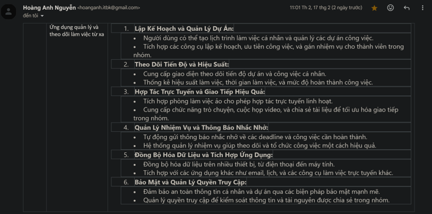

Yêu cầu BTL nhóm được phân công

 
Dựa theo email thầy phân công, chúng em xin phép được phân tích yêu cầu bài tập lớn như sau :
1. Lập Kế Hoạch và Quản Lý Dự Án
Mô tả yêu cầu:
•	Cho phép người dùng tạo lịch trình làm việc cá nhân và quản lý dự án.
•	Cung cấp các công cụ lập kế hoạch, ưu tiên công việc và gán nhiệm vụ cho thành viên trong nhóm.
Công nghệ sử dụng:
•	Room Database: Lưu trữ dữ liệu trên máy local.
•	Firebase Firestore: Lưu trữ danh sách nhiệm vụ, lịch trình làm việc trên cloud.
•	XML + RecyclerView: Hiển thị danh sách nhiệm vụ trong giao diện.
•	WorkManager: Lên lịch nhắc nhở công việc.
•	LiveData + ViewModel: Cập nhật dữ liệu theo thời gian thực.
2. Theo Dõi Tiến Độ và Hiệu Suất
Mô tả yêu cầu:
•	Cung cấp giao diện để theo dõi tiến độ dự án và công việc cá nhân.
•	Thống kê hiệu suất làm việc, thời gian làm việc, và mức độ hoàn thành công việc.
Công nghệ sử dụng:
•	Firebase Analytics hoặc Room Database: Ghi nhận dữ liệu về tiến độ công việc.
•	MPAndroidChart: Vẽ biểu đồ hiệu suất làm việc.
•	LiveData + ViewModel: Đồng bộ dữ liệu với giao diện UI theo thời gian thực.
3. Hợp Tác Trực Tuyến và Giao Tiếp Hiệu Quả
Mô tả yêu cầu:
•	Tích hợp phòng làm việc ảo cho phép họp trực tuyến linh hoạt.
•	Cung cấp chức năng trò chuyện, cuộc họp video, và chia sẻ tài liệu.
Công nghệ sử dụng:
•	WebRTC hoặc Jitsi SDK: Hỗ trợ gọi video trực tuyến.
•	Firebase Realtime Database: Quản lý tin nhắn trò chuyện.
•	ExoPlayer và MediaRecorder: Ghi âm, phát lại tin nhắn thoại.
•	Firebase Storage: Chia sẻ tài liệu, tệp tin.
4. Quản Lý Nhiệm Vụ và Thông Báo Nhắc Nhở
Mô tả yêu cầu:
•	Tự động gửi thông báo nhắc nhở về deadline.
•	Hệ thống quản lý nhiệm vụ giúp theo dõi công việc hiệu quả.
Công nghệ sử dụng:
•	WorkManager: Đặt lịch thông báo nhắc nhở.
•	Push Notifications (Firebase Cloud Messaging - FCM): Gửi thông báo từ server.
•	Room Database hoặc Firestore: Lưu danh sách công việc cần hoàn thành.
•	XML + RecyclerView: Hiển thị danh sách công việc trong UI.
5. Đồng Bộ Hóa Dữ Liệu và Tích Hợp Ứng Dụng
Mô tả yêu cầu:
•	Đồng bộ dữ liệu trên nhiều thiết bị.
•	Tích hợp với các ứng dụng khác như email, lịch, công cụ làm việc trực tuyến.
Công nghệ sử dụng:
•	Google Drive API hoặc Firebase Firestore: Lưu trữ và đồng bộ dữ liệu.
•	WorkManager: Đồng bộ dữ liệu nền ngay cả khi không mở ứng dụng.
•	Google Calendar API: Liên kết sự kiện với lịch của Google.
•	OAuth2 Authentication: Đăng nhập với tài khoản Google để truy cập dữ liệu cá nhân.
6. Bảo Mật và Quản Lý Quyền Truy Cập
Mô tả yêu cầu:
•	Bảo mật thông tin cá nhân và dự án.
•	Quản lý quyền truy cập dữ liệu trong nhóm.
Công nghệ sử dụng:
•	Firebase Authentication hoặc OAuth2: Quản lý xác thực đăng nhập.
•	AES Encryption hoặc Jetpack Security: Mã hóa dữ liệu quan trọng.
•	Firebase Firestore Rules: Phân quyền truy cập dữ liệu theo vai trò.
•	Biometric API: Đăng nhập bằng vân tay hoặc nhận diện khuôn mặt.

Phân công công việc
Hoàng Quốc Anh	- Phòng làm việc trực tuyến
- Đồng bộ hóa và tích hợp với các ứng dụng liên quan
- Bảo mật và quyền truy cập
Lê Minh Phúc	- Lập kế hoạch và quản lý dự án
Hà Văn Dũng	- Theo dõi tiến độ và hiệu suất
Phạm Quang Hà	- Quản lý nhiệm vụ và thông báo nhắc nhở

